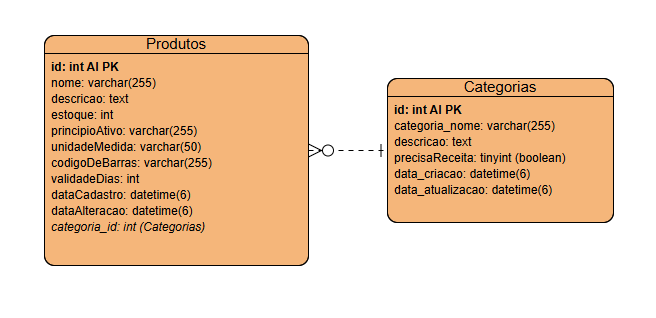

### Projeto Final do Bloco 2 - Generation Brasil

# 🏥 Sistema de Comércio Eletrônico para Farmácia

Este projeto é um sistema de **backend** de um e-commerce para uma farmácia, desenvolvido como projeto final do bloco 2 do bootcamp da Generation Brasil. O objetivo principal é criar uma solução que otimize as operações de gerenciamento de medicamentos, estoque, vendas e atendimento ao cliente, atendendo às necessidades específicas do setor farmacêutico.

A API foi desenvolvida seguindo as melhores práticas do **backend** e está documentada com **Swagger**, o que facilita a visualização e o teste das rotas.

---

### 📈 Diagrama das classes do projeto 

<div align='center'>
  
</div>

---

### 🚀 Tecnologias Utilizadas

* **Linguagem:** TypeScript
* **Framework:** NestJS
* **ORM:** TypeORM
* **Banco de Dados:** MySQL
* **Documentação:** Swagger
* **Gerenciador de Pacotes:** npm ou yarn

---

### 💻 Funcionalidades da API

A API foi projetada para gerenciar as duas principais entidades do sistema: **Categorias** e **Produtos**.

#### **Categorias de Produtos Farmacêuticos**

* **`GET` `/categorias`**: Busca todas as categorias de produtos.
* **`GET` `/categorias/id/:id`**: Busca uma categoria específica pelo seu ID.
* **`GET` `/categorias/nome/:nome`**: Busca categorias por um nome parcial ou completo.
* **`GET` `/categorias/precisa_receita`**: Busca todas as categorias de produtos que exigem receita médica.
* **`POST` `/categorias`**: Cria uma nova categoria.
* **`PUT` `/categorias`**: Atualiza uma categoria existente.
* **`DELETE` `/categorias/id/:id`**: Deleta uma categoria pelo seu ID.

#### **Produtos Farmacêuticos**

* **`GET` `/produtos`**: Retorna todos os produtos cadastrados.
* **`GET` `/produtos/id/:id`**: Busca um produto específico pelo seu ID.
* **`GET` `/produtos/nome/:nome`**: Busca produtos pelo nome (parcial ou completo).
* **`GET` `/produtos/descricao/:descricao`**: Busca produtos por palavras-chave na descrição.
* **`GET` `/produtos/principio/:principio`**: Busca produtos pelo princípio ativo.
* **`GET` `/produtos/codigo/:codigo`**: Busca produtos pelo código de barras.
* **`POST` `/produtos`**: Cria um novo produto, associando-o a uma categoria existente.
* **`PUT` `/produtos`**: Atualiza um produto existente.
* **`DELETE` `/produtos/id/:id`**: Deleta um produto pelo seu ID.

---

### 🛠️ Como Executar o Projeto

Para rodar este projeto na sua máquina, siga os passos abaixo:

1.  **Pré-requisitos:**
    * Node.js (versão 18 ou superior)
    * Um servidor MySQL
    * Um gerenciador de pacotes (npm ou yarn)

2.  **Configuração do Banco de Dados:**
    * Crie um banco de dados no seu servidor MySQL com o nome `db_farmagen`.
    * Execute o script `db_farmagen.sql` para criar as tabelas e popular o banco com dados de exemplo.

3.  **Configuração do Ambiente:**
    * Crie um arquivo `.env` na raiz do projeto.
    * Copie o conteúdo do arquivo `.env_sample` para o seu novo arquivo `.env` e preencha com as suas credenciais de acesso ao banco de dados:
        ```env
        DB_HOST=localhost
        DB_PORT=3306
        DB_USERNAME=seu_usuario
        DB_PASSWORD=sua_senha
        DB_NAME=db_farmagen
        PORT=4000
        ```

4.  **Instalação e Execução:**
    * Instale as dependências do projeto:
        ```bash
        npm install
        ```
    * Inicie a aplicação:
        ```bash
        npm run start:dev
        ```

---

### 📄 Documentação da API (Swagger)

A documentação interativa da API está disponível no endpoint `/swagger` após a inicialização do servidor. Você pode acessá-la em:

* **`http://localhost:4000/swagger`**

---

### 🤝 Contribuidor

* **Lucas Alves Pinheiro** - [@RaideriSpace](https://github.com/RaideriSpace/projeto_final_bloco_02) - l.pinheiro.w@gmail.com

---

Este projeto foi desenvolvido como parte do bootcamp da **Generation Brasil**.